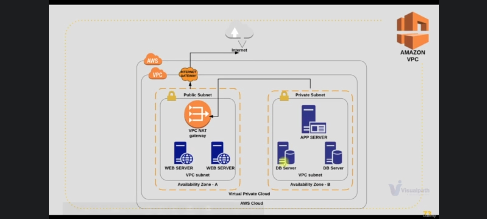
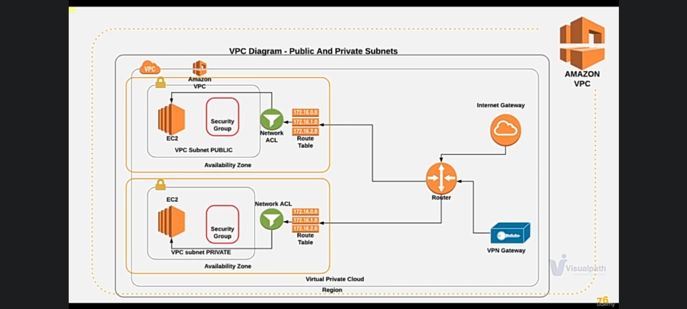
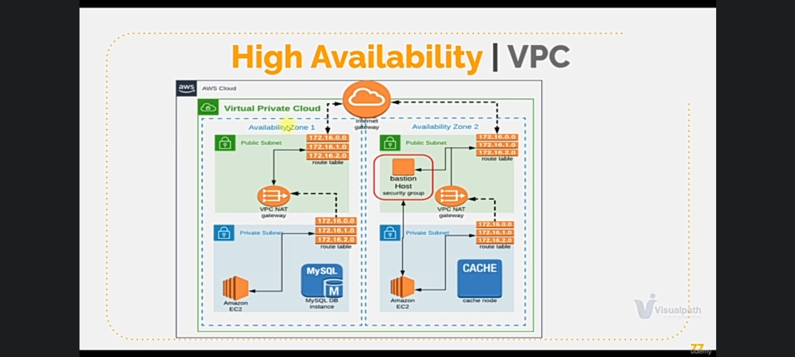

## VIRTUAL PRIVATE CLOUD DESIGN AND COMPONENTS PROJECT

According to AWS, [Amazon Virtual Private Cloud (Amazon VPC)](https://docs.aws.amazon.com/vpc/latest/userguide/what-is-amazon-vpc.html) enables you to launch AWS resources into a virtual network that you've defined. This virtual network closely resembles a traditional network that you'd operate in your own data center, with the benefits of using the scalable infrastructure of AWS.

__BASIC VPC DESIGN__

In the architecture above, VPC is the main network which is divided into smaller subnets. There are two kinds of subnets in VPC - 

- __Public Subnet__ - which can be reached directly from the internet through the __internet gateway__. The traffic from the instances in the public subnet can send traffic to the internet and traffic generated from the internet can be recieved by this subnet. eg __ssh__ into an instance.

- __Private Subnet__ - Traffic generated from the internet cannot get into the private subnet. There will be no public IPs only private IPs. If  the instances in this subnet need to access the internet (eg when seting up a database server), it does that through the __NAT gateway__ then sends the traffic to the internet gateway which is in the public subnet.

Network Address Translation(NAT) enables instances in a private subnet to connect to the internet or other AWS services.

An internet gateway is a horizontal, scaled, redundant and highly available VPC component that allows communication between instances in the VPC and the internet.

__VPC DIAGRAM - SUBNETS AND COMPONENTS__

Here the instances communicates with the internet gateway through the __Route table__. The route table is attached to the subnet and it tells the EC2 instances that it has to forward traffic to the internet gateway. The Route table also tells the EC2 instances in the private subnet to forward traffic to the NAT gateway. The internet gateway and the NAT gateway are both routers.
If we want to connect to the private subnet directly, we use the VPN gateway.

__HIGH AVAILABILITY VPC__

When a VPC is created it is assigned to a zone, the subnet is created in a zone.
Zones are clusters datacenters. Every region in AWS has atleast 2 zones. We need to create the VPC in atleast 2 zones so if one zone is down, the subnet in the other zone will be up and running - __high availability__.

So if we have 4 instances we can distribute them in two different zones for high availability. Same if we have more instances we can distribute them properly.

In this project, we will be connecting our instances on the private subnet from the __Bastion/Jump Server__ which is an instance in the public subnet. The bastion server will be connected from the internet and we can onnect from the bastion server to the private subnet.

Each of the zones will have private, public subnets, NAT gateway and Route table.

__AWS VPC DESIGN__

To set up the design, we will need to decide on Region, VPC Range, subnets etc:

- Region - North Virginia [us-east-1]
- We will decide on a VPC network range. For this project we have decided on using __172.20.0.0/16__.

VPC Range - __172.20.0.0/16__

- 4 subnets - 2 Public subnets and 2 Private subnets.
- Zones - us-east-1a and us-east-1b
- subnet range -

172.20.1.0/24 - public subnet-1 in [us-east-1a]

172.20.2.0/24 - public subnet-2 in [us-east-1b]

172.20.3.0/24 - private subnet-1 in [us-east-1a]

172.20.4.0/24 - private subnet-2 in [us-east-1b]

- 1 Internet Gateway
- 2 NAT Gateway - for each zone
- 1 Elastic IP assigned to the NAT Gateway
- 4 route tables
- 1 Bastion host/Jump server in the public subnet so we can access instances in the private subnet.

We will also make use of __NACL - Network Access Control__ List for the subnets. The [difference](https://digitalcloud.training/aws-security-group-vs-nacl-key-differences/) between __Security Groups__ and __NACL__.
- We will create an extra VPC for [VPC Peering](https://docs.aws.amazon.com/vpc/latest/peering/what-is-vpc-peering.html).

