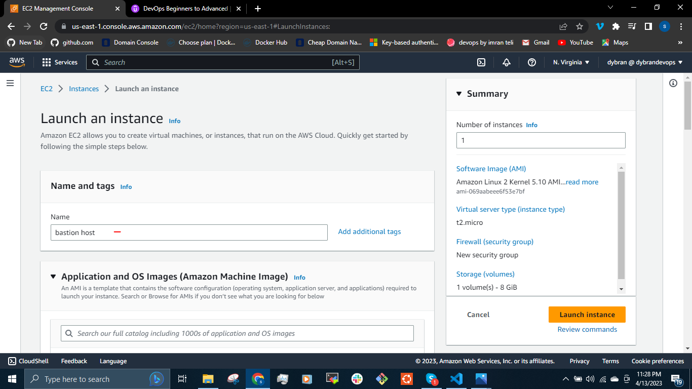

## MANUAL DESIGN OF VIRTUAL PRIVATE CLOUD
According to AWS, [Amazon Virtual Private Cloud (Amazon VPC)](https://docs.aws.amazon.com/vpc/latest/userguide/what-is-amazon-vpc.html) enables you to launch AWS resources into a virtual network that you've defined. This virtual network closely resembles a traditional network that you'd operate in your own data center, with the benefits of using the scalable infrastructure of AWS.

__BASIC VPC DESIGN__

In the architecture above, VPC is the main network which is divided into smaller subnets. There are two kinds of subnets in VPC - 

- __Public Subnet__ - which can be reached directly from the internet through the __internet gateway__. The traffic from the instances in the public subnet can send traffic to the internet and traffic generated from the internet can be recieved by this subnet. eg __ssh__ into an instance.

- __Private Subnet__ - Traffic generated from the internet cannot get into the private subnet. There will be no public IPs only private IPs. If  the instances in this subnet need to access the internet (eg when seting up a database server), it does that through the __NAT gateway__ then sends the traffic to the internet gateway which is in the public subnet.

Network Address Translation(NAT) enables instances in a private subnet to connect to the internet or other AWS services.

An internet gateway is a horizontal, scaled, redundant and highly available VPC component that allows communication between instances in the VPC and the internet.

__VPC DIAGRAM - SUBNETS AND COMPONENTS__

Here the instances communicates with the internet gateway through the __Route table__. The route table is attached to the subnet and it tells the EC2 instances that it has to forward traffic to the internet gateway. The Route table also tells the EC2 instances in the private subnet to forward traffic to the NAT gateway. The internet gateway and the NAT gateway are both routers.
If we want to connect to the private subnet directly, we use the VPN gateway.

__HIGH AVAILABILITY VPC__

When a VPC is created it is assigned to a zone, the subnet is created in a zone.
Zones are clusters datacenters. Every region in AWS has atleast 2 zones. We need to create the VPC in atleast 2 zones so if one zone is down, the subnet in the other zone will be up and running - __high availability__.

So if we have 4 instances we can distribute them in two different zones for high availability. Same if we have more instances we can distribute them properly.

In this project, we will be connecting our instances on the private subnet from the __Bastion/Jump Server__ which is an instance in the public subnet. The bastion server will be connected from the internet and we can onnect from the bastion server to the private subnet.

Each of the zones will have private, public subnets, NAT gateway and Route table.

__AWS VPC DESIGN__

To set up the design, we will need to decide on Region, VPC Range, subnets etc:

- Region - North Virginia [us-east-1]
- We will decide on a VPC network range. For this project we have decided on using __172.20.0.0/16__.

VPC Range - __172.21.0.0/16__

- 4 subnets - 2 Public subnets and 2 Private subnets.
- Zones - us-east-1a and us-east-1b
- subnet range -

172.21.1.0/24 - public subnet-1 in [us-east-1a]

172.21.2.0/24 - public subnet-2 in [us-east-1b]

172.21.3.0/24 - private subnet-1 in [us-east-1a]

172.21.4.0/24 - private subnet-2 in [us-east-1b]

- 1 Internet Gateway
- 2 NAT Gateway - for each zone
- 1 Elastic IP assigned to the NAT Gateway
- 4 route tables
- 1 Bastion host/Jump server in the public subnet so we can access instances in the private subnet.

In every region we have a default VPC, atleast two subnets(one subnet in each zone), Internet gateway and Route table.
We can crteate VPC through the dashboard but we will be creating our VPC manually to manage our infrastructure better.

We create a VPC with the name __Dybran-VPC__ with the network range we decided to use - __172.21.0.0/16__

This will create a default route table and NACL. We will not be using the defaults as we are gong to be creating our own.

Next we create subnets inside the VPC that we have already created.
We will be crteating 4 subnets (2 private and 2 public) in 2 zones for high availability.

The subnets are created using the subnets we defined above.

Create the public subnets

Create the private subnets

We do this for the private and public subnets in another zone (us-east-1b).
For high availability, we need to have atleast two availability zones.

We need to create an internet gateway and attach it to our VPC.

Attach the Internet gateway to our VPC

The internet gateway is then attached to the public subnets through the route table.

Click on "__subnet association__" then "__edit subnet association__"

Select the public subnets

When we click on route, we wil see that we have one route and any traffic going out to the public subnet and the IP is in the __172.21.0.0/16__ range is routed locally.

We will add another route which will send all other traffic in the IPv4 that is not in the range to go to the internet gateway that we created. This is what makes it a __public subnet__.

Create NAT gateways for the private subnet. The NAT gateways will be created in each of the public subnets in the 2 zones and allocated an elastic IP.

Let's create the route table for private subnet

Associate private subnets

Add route

All the traffic goes to the NAT gateway that we already created which makes it a __Private subnet__.

For every instance we will launching in the public subnet there should be an Public IP address attached to it.

So we go to the __subnets__ section, click on __action > Edit subnet setting__ and check __enable__ for both public and __DNS names__.

Every ec2 instance launched in the Public subnet gets a public address while the Ec2 instances launched in the private subnets only have private IPs.

We do this for the public subnets in the 2 zones.

Lets launch an Ec2 instance in these subnets. We will be launching an instance in the private subnet which will be accessed only through the load balancer attached to it. This load balancer will be in the public subnet.

The VPC and subnets we created are selected

When the instance is launched, we can see that no public IP is assigned.

So to be able to access this instance, we have to udse a __bastion host/jump server__ which will be launched in the public subnet.

We go to the inbound rule of the __cripsy-web01__ and allow traffic from the security group of the bastion host or we can be specific and allow from just the bastion host and not the security group of the bastion host.

This increases the safety of the instances in the private subnet but if the bastion host is compromised, then the instances in the private subnet is lost.

To validate the public subnet we created, we need to log into the bastion host.

From the bastion we need to __ssh__ into the __crispy-web01__ in the private subnet.

First we need to copy the "__.pem__" key used for the crispy web01 into the bastion host.

`$ scp -i dybran-ec2.pem <crispy-pem-key> ec2-user@<public-IP>:~/`

We log into the bastion host and change the permission on the pem key we copied.

`$ ls -ld dybran-ec2.pem`

`$ sudo chmod 400 dybran-ec2.pem`

We then use the pem key to ssh into the crispy web01 server

`$ ssh -i dybran-ec2.pem centos@<private-IP>`

We can set up the crispy webpage from tooplate.com using the  commands

`$ sudo -i`

`$ yum install httpd wget unzip -y`

`$ mkdir /tmp/webfilez`

`$ cd /tmp/webfilez`

`$ wget https://www.tooplate.com/zip-templates/2129_crispy_kitchen.zip`

`$ unzip 2129_crispy_kitchen.zip`

`$ cp -r 2129_crispy_kitchen/* /var/www/html`

`$ sudo systemctl start httpd`

`$ sudo systemctl enable httpd`

`$ sudo rm -rf /tmp/webfilez`

Next we create a load balancer in the public subnet to access the crispy web01.

Crispy web01 security group should allow connection from the load balancer

We can access the crispy web01 server from the load balancer using the DNS name

This setup increases the security of the instances in the private subnet.

We can create an Auto Scaling Group for the EC2 instances in the private subnets. 

